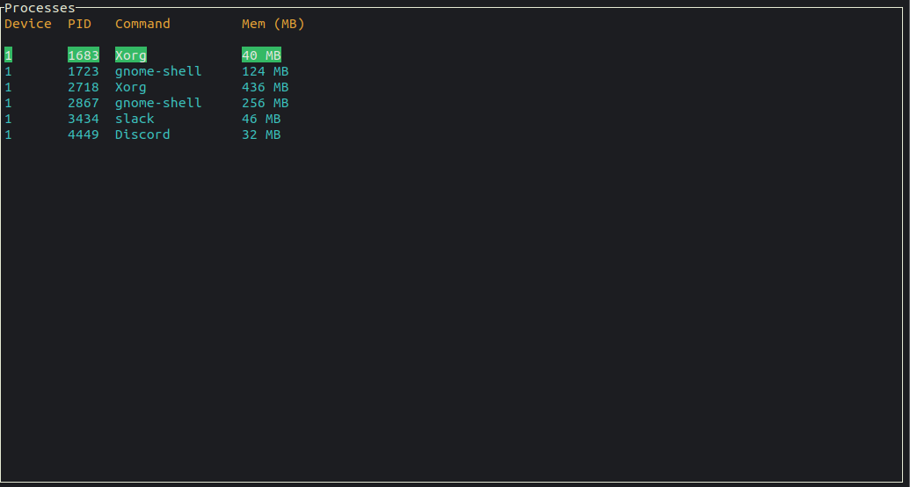
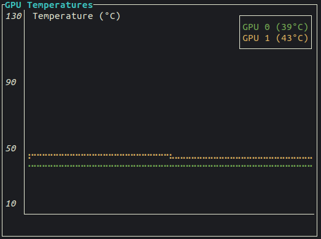
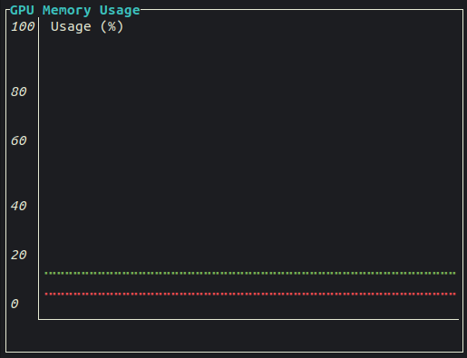

## ```rtop```

[](https://crates.io/crates/rtop)
[](https://docs.rs/crate/rtop)

```rtop``` is a system montior inspired by ```gtop``` implemented in Rust.

> Supports Linux and MacOS (other *nix systems may work but not tested)

System monitoring is handled by ```sysinfo``` and the UI is handled by ```tui-rs```.

## Installation

The application is distributed via `cargo`. Its recommended you install cargo using `rustup`.

Once installed you can install `rtop` using the following:

``` shell
cargo install rtop
```

To install the GPU monitor first you must have a NVIDIA Driver installed and nvidia-ml

Next you can install using 

``` shell
cargo install rtop --features gpu-monitor
```

If you are using rtop on a laptop you may also like a battery monitor. This can be enabled with

``` shell
cargo install rtop --features battery-monitor
```

## Panels 

### System 

#### CPU Usage

CPU Usage Percentage


#### Disk Usage 

Storage used for each partition


#### Memory Usage

Amount of memory and swap used


#### Processes 

List of processes running and memory and cpu usage


#### Network Usage

Network traffic going in an out of the machine


#### Battery

> Enabled by installing the `battery-monitor` feature

### GPU

#### Processes using GPU

List of tasks using the GPU



#### Temperatures

Shows the current core temperature of each device



#### GPU Memory Usage

Shows the percentage of GPU memory used on each Device 


